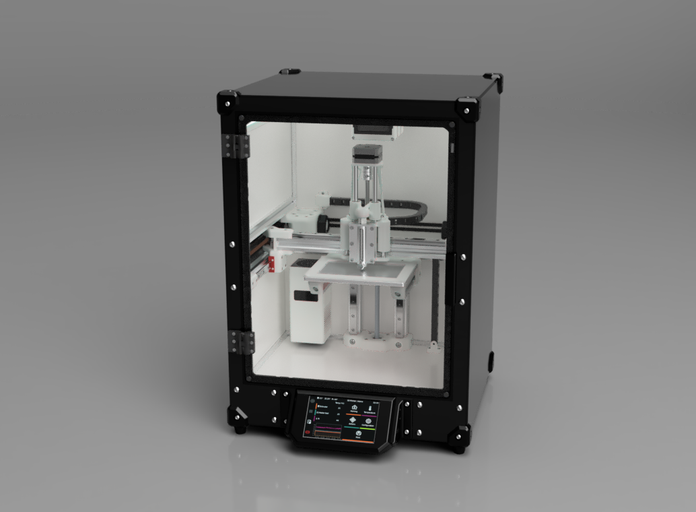

# BioPrinter CAD

## CAD and File Structure

This repository provides both assembly-level CAD files and print-ready part files.

### Assemblies
- Provided as `.STEP` and `.f3z` files
- Suitable for viewing, modification, and integration into other designs
- Includes full system and major subassemblies

### Printed Parts
- Provided as `.3mf` files
- Optimised for direct use in slicing software

## Related Repositories

- Firmware Configuration: https://github.com/arran2308/BioPrinter-Firmware  
- Printing Parameters: https://github.com/arran2308/BioPrinter-Printing-Parameters
