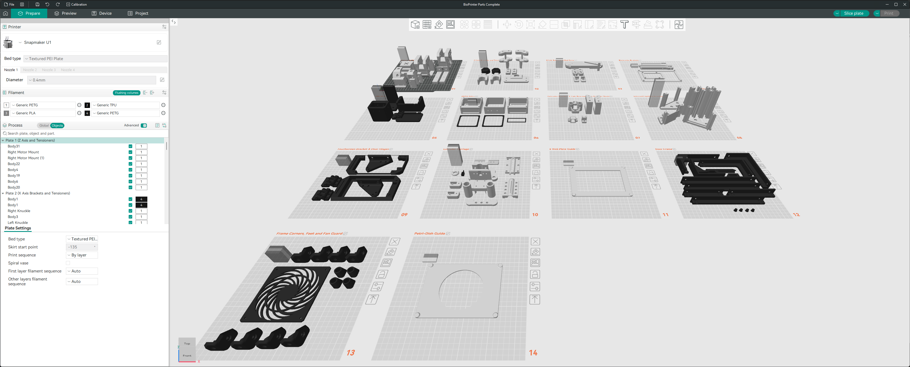

# Slicer Configuration

This section contains slicer-related assets and recommended settings for producing the 3D printed components of the BioPrinter.

---

## Overview

The slicer setup has been configured to prioritise:

- Structural strength
- Dimensional consistency
- Reliable support removal
- Repeatable print performance

The image below shows the full set of printed components arranged across multiple build plates.

  

---

## Materials

The following materials were used throughout the project:

- **PETG White**
- **PETG Black**
- **TPU Black**

**PLA should not be used for any part of this project due to its suseptability to creep with the BioPrinters elevated chamber temperature**
### Alternative Material

If an enclosed printer is available, the use of **ASA** is recommended due to its improved UV resistance and environmental durability.

---

## Print Settings

### General

Parts have been orientated for both optimised part strength and printability - it should not be necessary to reorientate any part included in the project file (**BioPrinter Parts Complete.3mf**).

- **Layer Height:** 0.2 mm  
- **Wall Count:** 3 walls  

These settings provide a balance between print time, strength, and surface quality.

---

## Supports

Supports are required for several components due to geometry and orientation.

- **Support Type:** Normal (Auto)
- **Support Interface Material:** PLA
- **Top Z Distance:** 0 mm
- **Interface Pattern:** Rectilinear
- **Top Interface Spacing:** 0 mm

### Notes

- A zero top Z distance ensures a strong interface between the support and part, improving underside quality.
- PLA is used as an interface material to aid separation from PETG components.

---

## Slicer Compatibility

These settings were developed using **OrcaSlicer**.

For best results:
- Use OrcaSlicer where possible
- Import the provided project files
- Avoid altering support interface settings unless necessary
